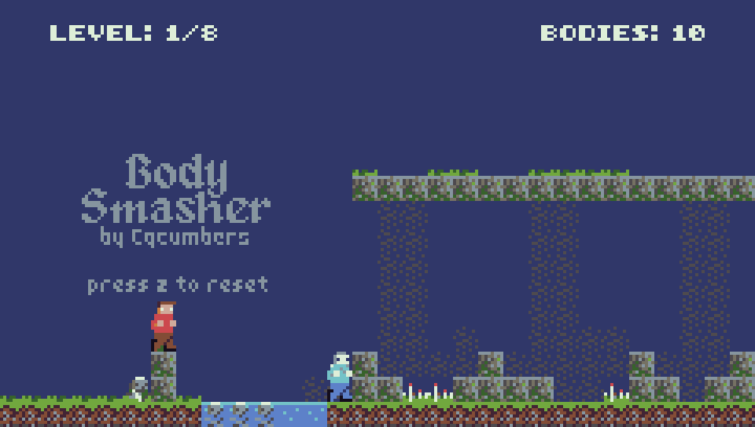

# Body Smasher
> Ludum Dare 43 Compo submission

In the puzzle platformer Body Smasher, sacrificing yourself to create zombie clones is the only way forward. Your undead helpers push buttons, create platforms, and open doors, but they also faithfully mirror your every move, so you'll have to think ahead to position everything correctly. Furthermore, opportunities for sacrifice are limited by the environment, and killing a zombie at a hazard means you can no longer die there. This is my first Ludum Dare submission, and my first time using the Wren programming language and TIC-80 fantasy console. I also attempted to compose some music for the first time, which probably took me way too much time.

The game has 8 levels and might take up to 30 minutes to complete, depending on how difficult you find each puzzle. Use the arrow keys to move and z to reset the level. Check it out at [cqcumbers.com/body\_smasher](https://cqcumbers.com/body_smasher).

## Screenshot

